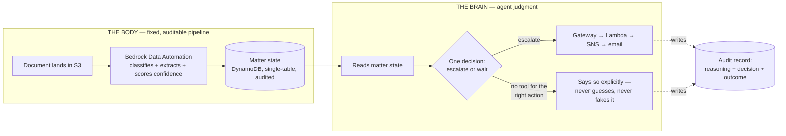

# Document-Chase Agent

**An AI agent that chases missing documents in regulated back offices
and can prove why it did what it did.**

For each **matter** (a group renewal, a claim, an onboarding, a closing) it
tracks which documents are still outstanding, decides what should happen next,
and acts — unsupervised, on a daily schedule — while writing a permanent record
of its reasoning.

It runs on real AWS infrastructure. **[DEMO.md](DEMO.md) walks through it
working**, with verbatim excerpts from live audit records: the agent escalating
an unreadable document, declining to repeat itself, and — when the right action
had no tool wired for it — saying so explicitly instead of forcing the wrong one.



## The design principle

**The pipeline is a fixed, auditable code path. The agent owns only the
judgment.**

Ingestion, classification, and extraction run as a fixed path with
confidence-scored extraction and mandatory human review below threshold.
**There is no agentic loop in extraction** — nothing there chooses what to do
next; it decides what a document *says* and attaches a number saying how sure it
is. "How did you get this field?" is answered with the source document, the
extraction confidence, whether it crossed the review threshold, and who approved
it if it did not. Not "the model decided."

The agent receives state that has already been established and answers exactly
one question: *what should happen next on this matter?* Its blast radius is the
tool list, not the model.

See [docs/architecture.md](docs/architecture.md) for the full picture, including
the unattended sweep and its guardrails.

## Where the interesting decisions are

The build log is the point of this repo as much as the code. Each of these is a
decision that turned out to matter, recorded with the evidence that drove it:

| | |
|---|---|
| [ADR-001](docs/decisions/ADR-001-foundation-model.md) | Choosing the production model by evaluation, not vibes — and the mechanical rubric that disqualified two candidates |
| [ADR-002](docs/decisions/ADR-002-bda-vs-textract.md) | Bedrock Data Automation vs Textract, and the honest limit of calling any of it "deterministic" |
| [ADR-005](docs/decisions/ADR-005-document-matter-correlation.md) | Correlating documents to matters; the SES/domain constraint that still gates outbound email |
| [ADR-006](docs/decisions/ADR-006-agent-architecture.md) | Building the agent natively on stable CDK L1s instead of an alpha sub-project |
| [ADR-007](docs/decisions/ADR-007-harness-tool-injection-failure.md) | **The managed AgentCore Harness never injected tools into the model request.** Proven from the literal request bytes, then architected around |
| [step-6 design notes](docs/step-6-agent-design.md) | The long-form build log: guardrail design, and the verification failures that shaped it |

Two lessons from those notes generalise beyond this project, and both were
learned the expensive way:

- **A probabilistic guard is not a structural guarantee.** A model behaving
  correctly is evidence; only code that cannot do otherwise is a control.
- **A test is trustworthy only once shown to fail on a known-bad input.** A
  verification suite here passed while the pipeline it checked was broken, more
  than once.

## Status

**Steps 1–7 complete. The system works end to end on real infrastructure — the
deterministic pipeline, the agent on top of it, and the agent running
unattended on a daily schedule.** A document lands in S3,
Bedrock Data Automation classifies and extracts it, the result is correlated to
its matter, confidence-scored, and written to matter state — and where it can't
be trusted (low confidence) or can't be placed (an unassociated document) it
routes to a human instead of guessing. On top of that state the agent reads a
matter, judges the next action, and — for an overdue, low-confidence matter —
escalates to a human through the Gateway, writing the audit row and sending the
email. Verified against the persisted artifacts, not the invoke's word.

| Stack | Contains | Status |
|---|---|---|
| `Ida-Dev-Shared` | KMS CMK, rotation on, alias `alias/ida-dev-data` | Real |
| `Ida-Dev-State` | DynamoDB `ida-dev-matters`, single-table `PK`/`SK` + `GSI1`, on-demand, CMK, PITR | Real |
| `Ida-Dev-Ingestion` | S3 raw bucket — CMK, versioned, TLS-only, public access blocked, EventBridge on | Real |
| `Ida-Dev-Understanding` | BDA project + census blueprint, submit + mapper Lambdas, 2 EventBridge rules | Real |
| `Ida-Dev-Agent` | Gateway + `escalate_to_human` target + tool Lambda + SNS + messaging config; the daily sweep Lambda, its EventBridge **Scheduler**, and 3 CloudWatch alarms (managed Harness retired — ADR-007; the agent runs client-side from `agent/core/`) | Real |
| `ViewStack` | Defined in [infra/lib/view-stack.ts](infra/lib/view-stack.ts), not instantiated | Later |

All five are `CREATE_COMPLETE` in dev (us-east-1).

**Agent runtime probe (Step 3) — retired and removed.** A separate stack,
`AgentCore-IdaAgentProbe-dev`, deployed by `agentcore deploy` rather than by
`infra/`. It reached **READY** and was invoked successfully, which was its whole
job: prove the `create → deploy → invoke` loop before any real tool existed. It
is **no longer deployed** — neither the stack nor the runtime remains in the
account — because Step 6 builds the agent natively in `infra/` on the stable
AgentCore L1s. The Step-3 record and its findings are kept in
[agent/runtime/README.md](agent/runtime/README.md).

### Step 5 — the thin slice, proven

Verified in-account, not just from the readout: a synthetic document per matter
lands under `matters/<id>/…` → an S3 EventBridge event starts a BDA job →
BDA's completion event drives a mapper that writes matter state.

- **Correlation** (ADR-005): documents matched to matters by S3 key prefix; the
  one document that didn't match surfaced in a **triage** queue, never
  auto-assigned.
- **Extraction + confidence gate** (ADR-002): every census correlated and
  extracted (group numbers came through correctly), each confidence-scored and
  routed by the per-field minimum.
- **Nothing invented**: the required document that was never uploaded stayed
  `missing` — the thing the agent chases in Step 6.

**Confidence finding.** On the synthetic hand-built PDFs, `employer_name`
extracts at **0.10–0.42** confidence, below the 0.8 gate, so **every census
routes to `in-review`, not `received`.** This is the confidence gate working as
designed on minimal synthetic input — the extraction itself is correct. Threshold
calibration, and whether to gate on all fields vs. only identity fields, is
**deferred to the ADR-002 measurement pass with realistic documents**; it is a
tuning decision, not a fix. See
[docs/step-5-notes.md](docs/step-5-notes.md) for the full close-out, the
integration-reality log, and deferred items.

### Step 6 — the agent, proven

The agent reads one matter's state and history and decides the single next
action — proven on **two matters with two distinct judgments**:

- **`MTR-2026-0142`** — census `in-review`, 9 days overdue at 0.256 confidence;
  signed employer application missing and overdue; target close date passed. The
  agent **escalates rather than sending another reminder**, citing four
  simultaneously-active triggers (both document due dates passed, the target
  close date passed, the census unreadable, the application still missing). A
  second run, seeing the escalation already in the matter's history, correctly
  does **nothing**. The verbatim reasoning is in [DEMO.md](DEMO.md) §1–§2.
- **`MTR-2026-0157`** — census *received* and `in-review` at 0.41 confidence,
  **not** overdue. The agent escalates on **data quality alone** and explicitly
  reasons that this is *not* a reminder case, because the document arrived — the
  problem is that its extraction can't be trusted, and correcting it silently
  would destroy the audit trail.

That second case is the one worth reading: the same prompt and the same tool
produce a materially different rationale, which is the judgment the agent is
actually for.

Every leg verified in-account against the artifacts, not the invoke's word: the
`ACTION#escalate` row (this account's schema) on each matter by a
strongly-consistent read; the escalate Lambda's log stream through `sns.publish`;
an `AUDIT#` decision record tying reasoning → decision → outcome; `toolConfig`
populated in the model request (correlated by `modelRequestId`); and the
escalation **email delivered** (SNS `NumberOfNotificationsDelivered=1`,
`NumberOfNotificationsFailed=0`, in the publish's minute).

**The architecture reversal (ADR-007).** The managed AgentCore Harness was the
intended agent runtime, but its runtime **did not inject tools** into the model
request — the configured gateway tool, an inline tool, and even the built-in
tools were all absent from the literal ConverseStream request (proven from
Bedrock model-invocation logs; the three-invocation table is in ADR-007). The
model reasoned but had no tool to call, so it narrated the call as JSON and
stopped. Resolution: **retire the Harness, keep the Gateway.** Orchestration moved
to a client-side loop (`scripts/agent-loop.py`): direct Bedrock Converse with a
`toolConfig` the loop builds, `toolChoice: auto` (so "do nothing" stays a valid
outcome), dispatching `tool_use` through the same Gateway (SigV4/MCP) to the
escalate Lambda. The client owns judgment; the Gateway still owns governed
execution and the per-call log. The `decide_and_act` core is written to port to a
Lambda trigger (state-change / scheduled sweep) without a rewrite.

**Findings** (full detail in [docs/step-6-agent-design.md](docs/step-6-agent-design.md)
and [ADR-007](docs/decisions/ADR-007-harness-tool-injection-failure.md)):

- **The managed-Harness base-permission contract.** A self-built Harness role
  must carry `bedrock-agentcore:GetWorkloadAccessToken`, X-Ray, logs, metrics, and
  ECR-public — the AgentCore CLI auto-provisions these, CDK does not. Missing
  them, the Harness fails silently. (Necessary — but not sufficient; see below.)
- **The managed-Harness tool-injection defect.** Even with the role correct and
  the Harness freshly created, the runtime injected no tools. Not config, not the
  gateway, not the model (a direct Converse with a `toolConfig` emits a real
  `tool_use`). A managed-runtime defect, proven from the request bytes.
- **The log-group retain bug.** `useCdkManagedLogGroup` gives each Lambda a RETAIN
  log group that orphans on destroy and collides on the next create; fixed by
  owning each with a DESTROY policy (the deferred Step-5 item, now done).
- **The email-subscription confirmation trap.** An SNS email subscription is
  created `PendingConfirmation` and needs a human click; CloudFormation reports
  `CREATE_COMPLETE` without waiting, and SNS **auto-deletes an unconfirmed
  subscription after ~3 days** — so the repeated destroy/recreate churn left the
  topic with **zero subscribers** while CFN still held the dead ARN (drift). The
  tool published successfully to nobody. Two consequences worth keeping:
  **(1)** a publish to a topic with no confirmed subscriber is **dropped, never
  queued or redelivered** — that notification is gone permanently, so confirm
  *before* the publish; **(2)** because the resource already existed in the
  template, re-adding it would have been a no-op — the fix was to give the
  subscription an explicit, stably-named construct (`EscalationEmailSub`), whose
  new logical id forces CFN to replace the drifted resource and re-send the
  confirmation. The durable upgrade (no click, survives any redeploy) is
  SNS → SQS, or SNS → Lambda → SES once the domain is verified.
- **The verification lesson.** Metrics, script self-reports, emitted tool-use
  blocks, and even a confident human "close-out" summary each lied at least once.
  The only truth was the persisted artifact read with a strongly-consistent read;
  a verifier must not be able to see the actor's output, or it echoes intent as
  fact.

**Resolved since:**

- **ADR-001 model eval — done.** Four candidates × seven pinned scenarios ×
  three runs, scored by a mechanical (non-LLM) rubric that disqualifies on a
  single missed escalation. **Claude Haiku 4.5** selected on the evidence: it
  matched Sonnet 4.6 action-for-action at roughly half the latency. Runs are
  committed under [evals/results/](evals/results/). Model-invocation logging is
  left ON (delivery role + log group + account-level config, tracked for
  cleanup).
- **Idempotency keyed on `docType` — done.** The escalate row's SK is built from
  a **normalised** `docType`, so the same decision phrased two ways
  (`census, signed-employer-application` on one run, `census` on the next)
  collides on one key instead of writing a second row and sending a second
  email. A prerequisite for running the sweep unattended, not an optimisation.

**Still deferred, deliberately:**

- **Cedar Policy** — waits on `send_reminder`; the Gateway is the enforcement
  point when it lands. There is no outbound tool with a real abuse surface to
  police yet, and a policy engine guarding one SNS publish is theatre.
- **`send_reminder`** — designed and schema-tested, blocked on a verified SES
  sending domain (ADR-005). Its reversal trigger and the full change-set it
  implies — including deleting the stopgap that makes the gap visible — are
  written down in [agent/tools/README.md](agent/tools/README.md).

### Step 7 — the sweep, running unattended

The agent now runs on its own. An EventBridge **Scheduler** — timezone-aware, so
it holds correct across DST, which a UTC-only Rule does not — invokes a sweep
Lambda at **07:00 America/New_York** daily. The sweep selects candidate matters,
runs the same `decide_and_act` core the CLI does, and dispatches through the
same Gateway. Live in dev now: schedule `ENABLED`, `DRY_RUN=false`, all three
alarms in `OK`.

Getting there was safety engineering, not a cron entry:

- **A structural pre-filter** that skips already-escalated matters *before the
  model is called at all*, applied **before** the per-run cap — cap-then-filter
  lets a backlog of handled matters consume the entire budget and do nothing.
- **Per-matter error isolation.** One failing matter cannot abort the batch, and
  its failure is written as an audit row rather than vanishing.
- **A hard-floored `DRY_RUN`** that no invoke payload can override, plus a kill
  switch (reserved concurrency 0) tested against both hand-invoked *and*
  scheduled executions.
- **Three CloudWatch alarms**, including a dead-man's switch that watches for a
  *completion* signal rather than merely that the schedule fired. Its first
  version watched the firing — which stayed healthy while the kill switch
  silently blocked every execution.
- **Caps and a valve** — bounded matters examined per run, bounded escalations
  dispatched per run.

Rolled out in deliberate stages, each verified against the persisted artifact
rather than a script's self-report: dry-run by hand → dry-run on schedule → live
by hand → live on schedule. Full picture in
[docs/architecture.md](docs/architecture.md#the-unattended-sweep); it running for
real is [DEMO.md](DEMO.md) §6.

## Layout

```
infra/          CDK (TypeScript) — the whole system
  bin/app.ts    entrypoint; stage from context, region pinned per stage
  lib/          config + one file per stack
  lambdas/      tool and pipeline handlers (Python)
agent/          the agent itself
  system-prompt.md  the control environment; its sha is stamped on every audit row
  core/         decide.py — one matter, one decision
                sweep.py  — the unattended run, its filters and caps
  tools/        the five tools and their AWS mappings (one is built)
  runtime/      Step-3 probe record (retired)
evals/          scenarios.json + committed run results (ADR-001)
docs/           architecture, ADRs, build log
scripts/        deploy, seeder, readout, agent loop, eval and sweep operations
web/            owner dashboard (later)
```

## Prerequisites

- **Node 24 LTS** (`infra/.nvmrc` pins 24; tested on 24.18.0, npm 11.16.0)

  > **Why the bump off Node 20.** The AWS SDK for JavaScript v3 requires
  > **Node ≥22 for versions published after the first week of January 2027**, and
  > the deprecation warning fired on every `cdk` and `agentcore` invocation. Node
  > 20 reaches end-of-life around the same date. Moved now rather than under
  > deadline mid-series.
  >
  > **Why 24 rather than 22.** `winget install OpenJS.NodeJS.LTS` installs
  > **24** — Node 24 is the current LTS line and 22 has moved to maintenance. 24
  > satisfies the ≥22 requirement with a longer support runway, so there was no
  > reason to pin backwards. It also happens to align `@types/node` with the
  > generated `agentcore/cdk/`, which was already on `^24`.
  >
  > ⚠️ **`.nvmrc` is inert on Windows — it is documentation, not enforcement.**
  > No version manager is installed here; Node comes from the plain
  > `C:\Program Files\nodejs` MSI. Note that **nvm-windows would not fix this**:
  > unlike nvm for bash, it has no automatic `.nvmrc` read — that needs a
  > hand-written shell hook. The file earns its keep for CI and for anyone
  > cloning on another machine, not for local switching.
  >
  > If real enforcement is ever wanted, **fnm** is the option that actually does
  > it: `winget install Schniz.fnm`, then enable `--use-on-cd` in the shell
  > profile so entering the directory switches versions automatically.
- AWS CLI v2, authenticated
- An AWS account you can bootstrap

For the agent, the tool Lambdas, and the eval harness:

- Python 3.10+ (tested on 3.11.9)

The next two are needed **only to reproduce the retired Step-3 runtime probe**.
Nothing in the current system uses the AgentCore CLI — the agent is built in
`infra/` from stable L1s and runs from `agent/core/`. Kept because the Step-3
record is still in the repo and the pinning lesson still applies:

- **`uv`** (tested on 0.11.30) — `pip install uv`
- AgentCore CLI, pinned: `npm install -g @aws/agentcore@0.24.1`

> ⚠️ **`uv` is a hard requirement, not optional.** The upstream
> `aws/agentcore-cli` README lists it as *"optional, for Python agent support"* —
> that is wrong. `agentcore create` aborts outright without it:
> `'uv' is required for Python projects`. Install it before Step 3.
>
> ⚠️ **Pin the AgentCore CLI to `0.24.1`** — not `@latest`, not `@preview`. npm
> carries a `preview` dist-tag at `1.0.0-preview.22`; a floating install can
> regenerate the agent project against a different config schema between
> sessions and break a deploy that worked yesterday. See
> [agent/runtime/README.md](agent/runtime/README.md).

## Deploy

### Configuration kept out of the repo

Two values are deliberately **not committed**, for the same reason
`aws-targets.json` and `cdk.context.json` are gitignored — they identify a real
account or a real person:

```bash
cp .env.example .env      # then fill in real values; .env is gitignored
```

⚠️ **Nothing auto-loads `.env`.** There is no `dotenv` here by design — the CDK
app reads `process.env` directly, so the file is the *list of variables you must
have exported*, not a config that takes effect on its own. Copying it and
deploying will silently use the fallbacks. Load it first:

```bash
set -a; . ./.env; set +a          # bash / zsh
```

| Variable | Why it is external |
|---|---|
| `IDA_SES_IDENTITY` | The verified SES identity used as the escalation/ops recipient and the `send_reminder` sender. A real address in dev. If unset, `infra/lib/config.ts` falls back to a reserved-for-documentation address, so a misconfigured deploy **fails loudly at SES on an unverified identity** rather than quietly emailing someone real. |
| `EXPECTED_ACCOUNT` | The 12-digit account the agent is deployed in. Operational scripts assert against it and refuse to run if the shell's credentials resolve elsewhere — the guard that closed a class of cross-account false readings during the build. |

```bash
cd infra
npm install
npx cdk synth -c stage=dev        # no AWS calls, safe to run anytime
```

Deploying without `IDA_SES_IDENTITY` set will synth and deploy, but the SNS email
subscriptions will point at the placeholder address:

```bash
IDA_SES_IDENTITY=you@example.com npx cdk deploy Ida-Dev-Agent -c stage=dev
```

First deploy — bootstraps the account, then deploys everything:

```bash
./scripts/deploy.sh dev
# or with a named profile:
AWS_PROFILE=my-profile ./scripts/deploy.sh dev
```

Equivalent by hand:

```bash
cd infra
npx cdk bootstrap                 # first run only
npx cdk deploy --all -c stage=dev
```

Tear down (dev only — everything is destroyable by design):

```bash
cd infra && npx cdk destroy --all -c stage=dev
```

## Skeleton decisions worth knowing

**Stages are config, not copies.** [infra/lib/config.ts](infra/lib/config.ts)
defines `dev` and `prod`. Only `dev` is instantiated. The meaningful difference
is `retainData`: prod keeps stateful resources on stack deletion, dev destroys
them. Adding prod later is one line in `bin/app.ts`, not a refactor.

**No account id in the repo.** The account resolves from
`CDK_DEFAULT_ACCOUNT` at synth time. The S3 bucket name interpolates it
(`ida-dev-raw-<account>`) for global uniqueness without committing it.

**Cross-stack values are passed as props, not looked up by name.** The KMS key,
bucket, and table are constructor arguments. With
`"@aws-cdk/core:defaultCrossStackReferences": "weak"` set in `cdk.json`, these
synthesize as `Fn::GetStackOutput` resolved by the CDK CLI at deploy time rather
than as hard CloudFormation `Export`/`ImportValue` pairs. On a greenfield
project whose stack boundaries are still moving, that avoids the "export cannot
be deleted as it is in use" deadlock. (This is now the default in a fresh
CDK 2.261.0 app, not a custom setting.)

**One CMK per stage, not one per service.** Simpler to audit, rotate, and revoke
— and revoking the key is the offboarding story.

**`cdk.context.json` is gitignored.** This repo is public, and cached CDK context
routinely contains account ids, AZ lists, and AMI ids. There are no `fromLookup`
calls today, so the file holds nothing worth keeping. ⚠️ **Revisit this in the
IDP step** — if that step introduces context lookups, the choice becomes: commit
a sanitized version (deterministic synth for anyone cloning, but account details
land in git history), or keep ignoring it and accept that fresh clones re-resolve
lookups against whatever account they are pointed at. Do not let it default
silently; an un-ignored `cdk.context.json` is a common way account ids leak into
a public repo.

**Deliberately deferred**, each tied to the step that needs it: VPC +
PrivateLink; SES **receipt** rules for inbound mail (ADR-005 — there is no
verified domain to receive on yet); the agent container-image build pipeline
(`CodeZip` sidesteps it until something needs a custom runtime).

Two items that were on this list are now built, noted so the list stays honest:
the single-table `PK`/`SK` schema with the missing-docs-by-due-date **`GSI1`**
(see the `Ida-Dev-State` row above), and the EventBridge triggers — two rules
driving the BDA pipeline, plus the Scheduler that runs the daily sweep.

## Versions

Pinned and verified against npm on 2026-07-21:

| Package | Version | Note |
|---|---|---|
| `aws-cdk-lib` | 2.261.0 | current latest |
| `aws-cdk` (CLI) | 2.1132.0 | current latest |
| `constructs` | ^10.7.1 | |
| `typescript` | ^5.7 | resolves 5.9.3 — **not** 7.x, see below |
| `tsx` | ^4.23.1 | runner, matches the current `cdk init` template |
| `@types/node` | ^24.10.1 | matched to the Node 24 runtime (resolves 24.13.3) |

**The app command is `npx tsc && npx tsx bin/app.ts`.** `tsx` transpiles without
type-checking, so the `tsc` half is not decoration — it is the type gate. Drop it
and type errors sail straight through into a synth. Verified by breaking a type
on purpose: synth fails with exit 1 before any template is written.

**`@types/node` moved in lockstep with the runtime.** Leaving it at `^20` would
have type-checked against a Node 20 stdlib on a Node 24 runtime, making newer
APIs appear not to exist. Bumped to `^24.10.1` *after* the Node install was
confirmed, so one `npm install` picked up matching types. No `engines` field is
declared anywhere in the repo, so nothing else needed to move with it.

**TypeScript is pinned to `^5.7` (resolves 5.9.3) on purpose.** Two separate
things push toward 7.x and both are declined for now: `latest` on npm is 7.x, and
a fresh `cdk init` on CLI 2.1132.0 now generates `"typescript": "~7.0.2"`. TS 7
is GA, but its stable compiler API does not land until 7.1, so the surrounding
tooling ecosystem still lags. TS 7 is a separate gated migration, not part of
this build.

## Roadmap

1. ~~Repo scaffold + CDK skeleton~~ ✅
2. ~~Prereqs and CDK app — confirm the full toolchain, stubs deploy cleanly~~ ✅
   — all five stacks `CREATE_COMPLETE` in dev, verified live in-account
3. ~~Prove the AgentCore toolchain — minimal Runtime, invoked once~~ ✅

   Runtime deployed via `agentcore deploy` (**not** `infra/`) and invoked
   successfully; status **READY**. Model was **Amazon Nova Micro, probe-only** —
   the scaffold's Claude Sonnet 4.5 default is gated behind an access form in
   this account, and the probe tested the toolchain rather than model quality.
   The production model was left deliberately undecided at this step, and was
   settled later by evaluation — **Claude Haiku 4.5**, see
   [ADR-001](docs/decisions/ADR-001-foundation-model.md).

   > ⚠️ **The container-image ordering gotcha has not been solved — it has been
   > sidestepped.** `CodeZip` builds upload a zip, so there is no image and no
   > ordering problem. A `Container` build reintroduces it: a `CfnRuntime` will
   > not resolve unless a valid image already exists at the referenced tag,
   > which forces CodeBuild → wait → runtime. **Expect this back when the real
   > agent needs a container** (custom system dependencies, a non-Python
   > runtime, or anything CodeZip cannot package).

4. ~~IDP Accelerator triage~~ ✅ — decided **not** to adopt
   `@cdklabs/genai-idp`; call the BDA APIs directly and keep the accelerator as
   a reference implementation. Five alpha CDK dependencies inside the
   deterministic pipeline, a 59-Lambda footprint, and a Docker-for-synth
   requirement were not worth ~200 lines of Lambda. See
   [ADR-004](docs/decisions/ADR-004-idp-accelerator-adopt-vs-direct.md).
5. ~~The thin slice~~ ✅ — synthetic document → S3 → BDA classifies and extracts
   → correlated to its matter (ADR-005) → confidence-scored matter state
   (ADR-002) → readout, with **triage and the confidence gate both firing**.
   Verified in-account. Close-out, integration-reality log, and deferred items
   in [docs/step-5-notes.md](docs/step-5-notes.md).
6. ~~The agent acts on this state~~ ✅ — it reads a matter, judges the single
   next action, and escalates through the Gateway when the state warrants it,
   writing the audit row and sending the email. The managed Harness turned out
   not to inject tools at all, so orchestration moved client-side while the
   Gateway kept governed execution
   ([ADR-007](docs/decisions/ADR-007-harness-tool-injection-failure.md)).

   Note the tool: **`escalate_to_human`, not `send_reminder`.** The reminder path
   needs a verified SES domain and is deliberately still deferred — which is why
   the agent says so explicitly when a reminder is the right call, rather than
   escalating as a substitute.
7. ~~Unattended operation~~ ✅ — a daily scheduled sweep with a structural
   pre-filter, per-run caps, per-matter error isolation, a kill switch, and three
   alarms including a dead-man's switch on completion. Staged from dry-run-by-hand
   to live-on-schedule, verified against the persisted artifact at each stage.

**Next**, in the order that unblocks the most:

1. **A verified sending domain**, which unblocks `send_reminder` — the one change
   that converts the agent's most frequent correct answer from a logged
   observation into an action. Everything else about that tool is already
   designed and schema-tested.
2. **Cedar policy at the Gateway**, once there is an outbound tool whose misuse
   would cost something real. Enforcement arrives with the thing worth enforcing.
3. **A read-only owner view** — the 30-second status check this was built to
   enable, promoted from a CLI readout to something a non-engineer opens.
