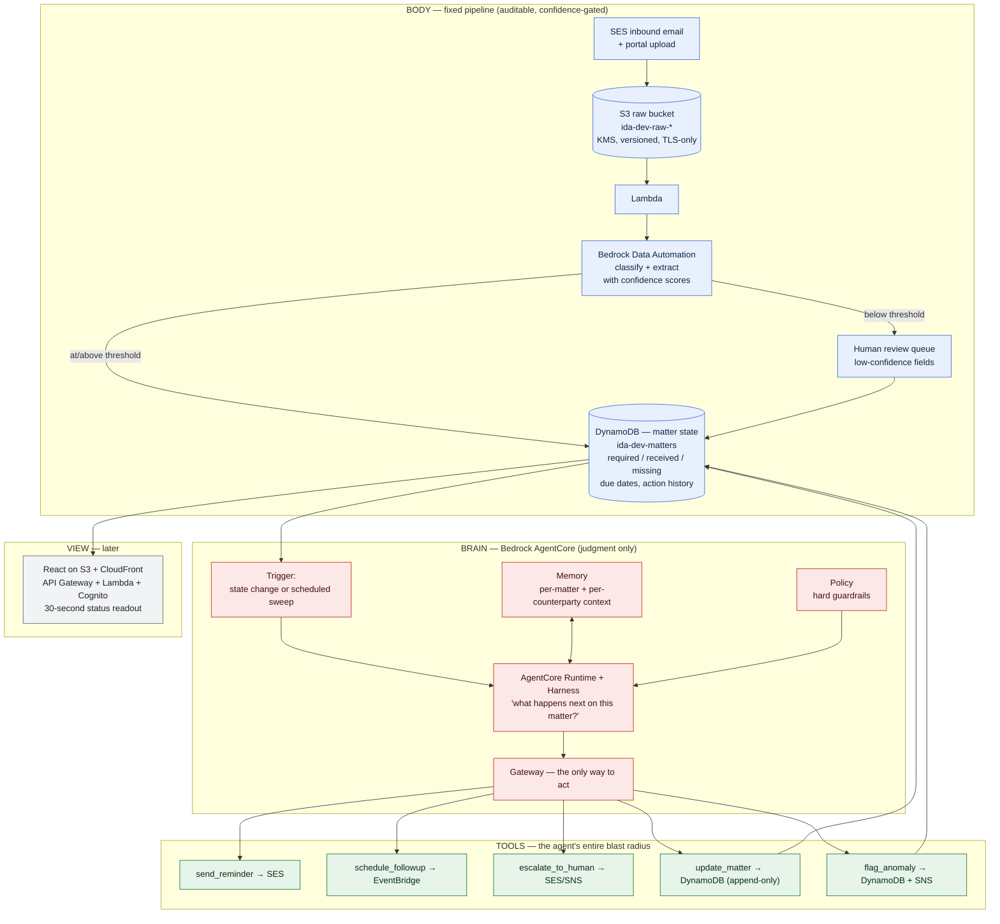
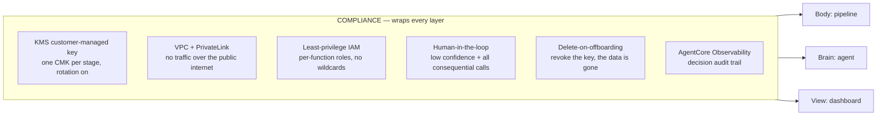

# Architecture

## The one decision everything else follows from

**The pipeline is fixed and auditable. The agent owns only the judgment.**

Ingestion, classification, and extraction run as a **fixed pipeline with
confidence-scored extraction and mandatory human review below threshold**. The
pipeline's shape never varies: every document follows the same path, every
extracted field carries a confidence score, and anything below threshold routes
to a person before it can touch matter state. Nothing in that path decides what
to *do* — it only decides what a document *says*, and says so with a number
attached.

> **An honest qualification.** Bedrock Data Automation is GenAI-powered — a
> foundation model sits inside this half of the system. So the earlier framing of
> this as a *deterministic* pipeline overclaimed, and a compliance reviewer would
> have caught it. What is actually true, and still meaningfully strong: the
> pipeline is **fixed, auditable, and confidence-gated**, and no model in it
> chooses an action. The distinction that matters for a regulator is not
> "no model touched this" — it is "the same input follows the same path, the
> system tells you how sure it is, and a human sees anything it is not sure
> about." See [ADR-002](decisions/ADR-002-bda-vs-textract.md), which also defines
> the reproducibility test that keeps this claim honest.

A regulator asking "how did you get this field" gets: the source document, the
extraction confidence, whether it crossed the review threshold, and who
approved it if it did not. That is a defensible answer. "The model decided" is
not.

The agent is handed state that has already been established and answers one
question: *what should happen next on this matter?* It can remind, wait,
escalate, flag, or record — and nothing else, because those five tools are its
entire capability surface.

Separating the two is what makes the system defensible. Mixing them is the
failure mode most "AI back-office" demos ship with.

## System



## Compliance layer

This wraps everything above rather than sitting beside it — it is not a
component, it is a property each component has to hold.



### Data residency note

Bedrock Data Automation is invoked through the US cross-region inference
profile:

```
arn:aws:bedrock:us-east-1:<account>:data-automation-profile/us.data-automation-v1
```

Documents are **stored** only in `us-east-1`, but inference requests and results
may traverse `us-east-1`, `us-east-2`, `us-west-1`, and `us-west-2`. Everything
stays inside the US geography and is encrypted in transit. This has to be stated
explicitly in any BAA or client data-handling document before real PHI/PII
touches the system — it is the kind of detail that surfaces late and badly if it
is not written down early.

## Stack layout

Stacks are namespaced by stage (`Ida-Dev-*`). Cross-stack resources are passed
as constructor props, not looked up by name.

| Stack | Contains | Status |
|---|---|---|
| `Ida-Dev-Shared` | KMS CMK + alias `alias/ida-dev-data` | Real |
| `Ida-Dev-State` | DynamoDB `ida-dev-matters` | Real |
| `Ida-Dev-Ingestion` | S3 raw bucket | Real |
| `Ida-Dev-Understanding` | SSM placeholder for the BDA project ARN | Stub |
| `Ida-Dev-Agent` | SSM placeholder for the AgentCore runtime ARN | Stub |
| `ViewStack` | Defined in code, not instantiated | Later |

`"@aws-cdk/core:defaultCrossStackReferences": "weak"` is set, so cross-stack
values synthesize as `Fn::GetStackOutput` resolved by the CDK CLI at deploy time
rather than as hard CloudFormation `Export`/`ImportValue` pairs. On a greenfield
project where the stack boundaries are still moving, this avoids the
"export cannot be deleted as it is in use" deadlock that otherwise forces a
multi-deploy dance every time a resource moves between stacks.

## Deferred on purpose

Each of these is deferred to the step that actually needs it, so the skeleton
stays readable:

- **DynamoDB single-table design** (sort key + GSI for missing-docs-by-due-date)
  — lands with the thin slice. Recreates the table; fine in dev.
- **VPC + PrivateLink** — lands with the compliance step. Nothing crosses the
  network yet.
- **SES receipt rules, EventBridge triggers, lifecycle rules** — land with
  ingestion.
- **The agent container image and its build pipeline** — lands with the
  AgentCore step. A `CfnRuntime` will not resolve without a valid image already
  pushed at the referenced tag, so that step is ordered
  CodeBuild → wait → runtime.
