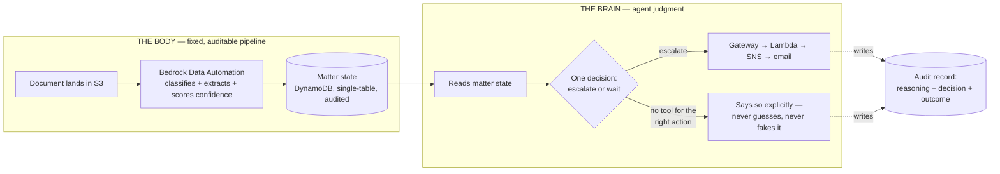
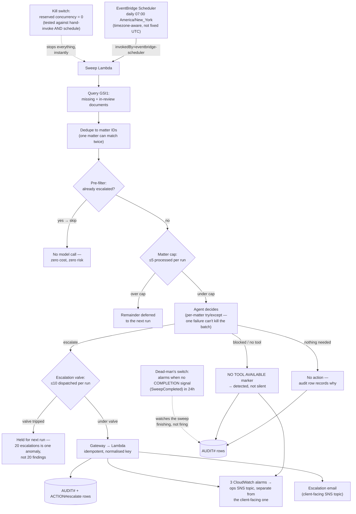
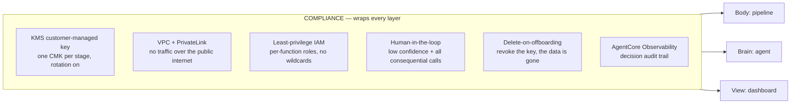

# Architecture

## The one decision everything else follows from

**The pipeline is fixed and auditable. The agent owns only the judgment.**

Ingestion, classification, and extraction run as a **fixed pipeline with
confidence-scored extraction and mandatory human review below threshold**. The
pipeline's shape never varies: every document follows the same path, every
extracted field carries a confidence score, and anything below threshold routes
to a person before it can touch matter state. Nothing in that path decides what
to *do* — it only decides what a document *says*, and says so with a number
attached.

> **An honest qualification.** Bedrock Data Automation is GenAI-powered — a
> foundation model sits inside this half of the system. So the earlier framing of
> this as a *deterministic* pipeline overclaimed, and a compliance reviewer would
> have caught it. What is actually true, and still meaningfully strong: the
> pipeline is **fixed, auditable, and confidence-gated**, and no model in it
> chooses an action. The distinction that matters for a regulator is not
> "no model touched this" — it is "the same input follows the same path, the
> system tells you how sure it is, and a human sees anything it is not sure
> about." See [ADR-002](decisions/ADR-002-bda-vs-textract.md), which also defines
> the reproducibility test that keeps this claim honest.

A regulator asking "how did you get this field" gets: the source document, the
extraction confidence, whether it crossed the review threshold, and who
approved it if it did not. That is a defensible answer. "The model decided" is
not.

The agent is handed state that has already been established and answers one
question: *what should happen next on this matter?* Its blast radius is the tool
list, not the model. Five tools are designed — remind, wait, escalate, flag,
record — and **production passes exactly one of them** (`escalate_to_human`);
the rest are deliberately unbuilt. Nothing outside that list is reachable, which
is why a missing capability surfaces as the agent saying so rather than as an
improvised substitute.

Separating the two is what makes the system defensible. Mixing them is the
failure mode most "AI back-office" demos ship with.

## System

The shape of the whole thing: a fixed pipeline establishes *what a document
says*, and an agent decides *what to do next* — with a permanent record of the
reasoning behind every decision.



**Note on the brain half.** Orchestration runs as a client-side loop calling
Bedrock Converse directly — *not* the managed AgentCore Harness, which was
retired after its runtime was found not to inject tools into the model request
at all ([ADR-007](decisions/ADR-007-harness-tool-injection-failure.md)). The
**Gateway is still in the path**: it holds the credentials, invokes the tool
Lambda, and logs every call, so the agent never holds AWS credentials itself.

Production currently wires **one** tool, `escalate_to_human`. The other four
remain designed and deferred — see [agent/tools/README.md](../agent/tools/README.md).

## The unattended sweep

The agent runs daily with no human in the loop. Everything below the decision
point exists because unsupervised execution needs guardrails that do not depend
on the model behaving well.



**Why the dead-man's switch watches completion, not firing.** Its first version
watched `InvocationAttemptCount` — whether the schedule fired. Arming the kill
switch proved that wrong: the Scheduler still *attempted* while the function
never ran, and Lambda emitted no throttle metric, so the block was entirely
silent. An alarm on firing would have reported a paused, throttled, or broken
sweep as healthy — the precise failure it exists to catch. It now watches a
`SweepCompleted` metric derived from the sweep's own completion log line, which
can only increment if the run finished.

**Why the pre-filter runs before the cap.** Capping first means already-escalated
matters consume cap slots and are then discarded, so a backlog starves the
sweep — throughput degrades toward zero while new matters wait for a tick that
never has room, silently and monotonically. Filtering first is affordable because
the filter is a DynamoDB query with no model cost.

## Compliance layer

This wraps everything above rather than sitting beside it — it is not a
component, it is a property each component has to hold.



### Data residency note

Bedrock Data Automation is invoked through the US cross-region inference
profile:

```
arn:aws:bedrock:us-east-1:<account>:data-automation-profile/us.data-automation-v1
```

Documents are **stored** only in `us-east-1`, but inference requests and results
may traverse `us-east-1`, `us-east-2`, `us-west-1`, and `us-west-2`. Everything
stays inside the US geography and is encrypted in transit. This has to be stated
explicitly in any BAA or client data-handling document before real PHI/PII
touches the system — it is the kind of detail that surfaces late and badly if it
is not written down early.

## Stack layout

Stacks are namespaced by stage (`Ida-Dev-*`). Cross-stack resources are passed
as constructor props, not looked up by name.

| Stack | Contains | Status |
|---|---|---|
| `Ida-Dev-Shared` | KMS CMK + alias `alias/ida-dev-data` | Real |
| `Ida-Dev-State` | DynamoDB `ida-dev-matters` | Real |
| `Ida-Dev-Ingestion` | S3 raw bucket | Real |
| `Ida-Dev-Understanding` | SSM placeholder for the BDA project ARN | Stub |
| `Ida-Dev-Agent` | SSM placeholder for the AgentCore runtime ARN | Stub |
| `ViewStack` | Defined in code, not instantiated | Later |

`"@aws-cdk/core:defaultCrossStackReferences": "weak"` is set, so cross-stack
values synthesize as `Fn::GetStackOutput` resolved by the CDK CLI at deploy time
rather than as hard CloudFormation `Export`/`ImportValue` pairs. On a greenfield
project where the stack boundaries are still moving, this avoids the
"export cannot be deleted as it is in use" deadlock that otherwise forces a
multi-deploy dance every time a resource moves between stacks.

## Deferred on purpose

Each of these is deferred to the step that actually needs it, so the skeleton
stays readable:

- **DynamoDB single-table design** (sort key + GSI for missing-docs-by-due-date)
  — lands with the thin slice. Recreates the table; fine in dev.
- **VPC + PrivateLink** — lands with the compliance step. Nothing crosses the
  network yet.
- **SES receipt rules, EventBridge triggers, lifecycle rules** — land with
  ingestion.
- **The agent container image and its build pipeline** — lands with the
  AgentCore step. A `CfnRuntime` will not resolve without a valid image already
  pushed at the referenced tag, so that step is ordered
  CodeBuild → wait → runtime.
